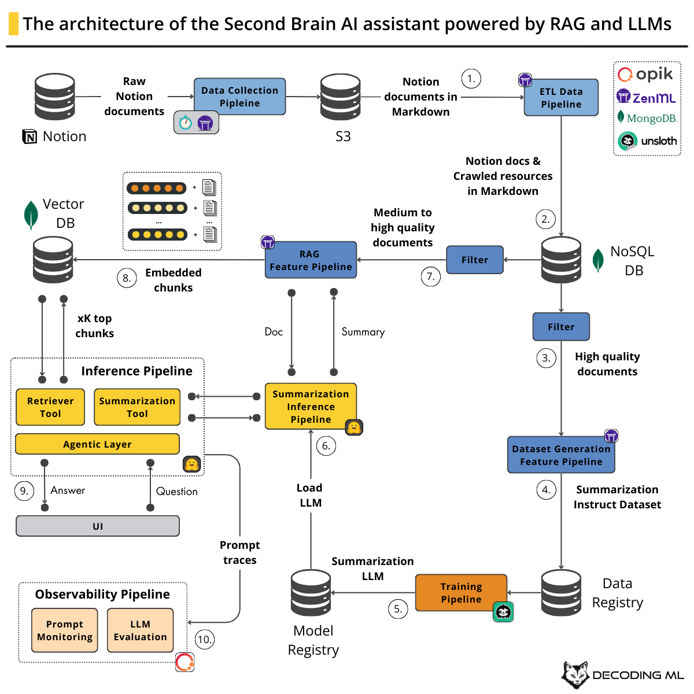
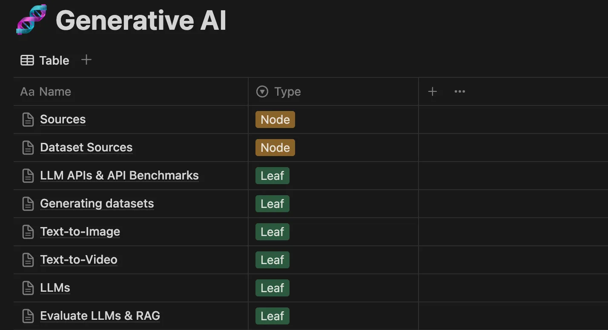
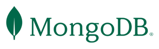
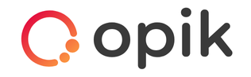

<div align="center">
  <h1>Building Your Second Brain AI Assistant Using Agents, LLMs and RAG</h1>
  <h3>Learn how to access the collective wisdom of your own mind</h3>
  <p class="tagline">Open-source course by <a href="https://decodingml.substack.com">Decoding ML</a> in collaboration with </br> <a href="https://rebrand.ly/second-brain-course-mongodb">MongoDB</a>, <a href="https://rebrand.ly/second-brain-course-comet">Comet</a>, <a href="https://rebrand.ly/second-brain-course-opik">Opik</a>, <a href="https://rebrand.ly/second-brain-course-unsloth">Unsloth</a> and <a href="https://rebrand.ly/second-brain-course-zenml">ZenML</a>.</p>
</div>

</br>

<p align="center">
  <a href="https://decodingml.substack.com/p/build-your-second-brain-ai-assistant">
    
  </a>
</p>

## 📖 About This Course

This course is part of Decoding ML's open-source series, teaching you how to build production-ready GenAI systems using LLMs, RAG, agents and LLMOps.

**The Second Brain AI Assistant** course contains **6 modules** that will teach you how to build an **advanced RAG and LLM system using LLMOps and ML systems best practices**. You'll learn to build an end-to-end AI assistant that chats with your Second Brain - your personal knowledge base of notes, resources, and storage.

By the end of this course, you'll be able to architect and implement a production-ready agentic RAG and LLM system from scratch.

### So What Is the Second Brain AI Assistant?

The Second Brain, a concept by Tiago Forte, is your personal knowledge base of notes, ideas, and resources. Our AI Assistant leverages this knowledge to answer questions, summarize documents, and provide insights.

Imagine asking your AI Assistant to recommend agent courses, list top PDF parsing tools, or summarize LLM optimization methods - all based on your research, without manually searching through notes.

While we use Notion for this course, the code is adaptable to other sources like Google Drive or Calendar. We'll provide our curated AI/ML resource list from Notion, covering GenAI, LLMs, RAG, MLOps, and more. **No Notion account needed** - but if you want to use yours, our flexible pipeline supports any Notion database.

----

<table style="border-collapse: collapse; border: none;">
  <tr style="border: none;">
    <td width="20%" style="border: none;">
      <a href="https://decodingml.substack.com/" aria-label="Decoding ML">
        
      </a>
    </td>
    <td width="80%" style="border: none;">
      <div>
        <h2>Stay Updated</h2>
        <p><b><a href="https://decodingml.substack.com/">Join Decoding ML</a></b> for proven content on production-grade AI, GenAI, and information retrieval systems. Every week, straight to your inbox.</p>
      </div>
    </td>
  </tr>
</table>

<p align="center">
  <a href="https://decodingml.substack.com/">
    
  </a>
</p>

----

### What You'll Do:

- Build an agentic RAG system powered by your Second Brain
- Design production-ready LLM architectures
- Apply LLMOps and software engineering best practices
- Fine-tune and deploy LLMs
- Use industry tools: OpenAI, Hugging Face, MongoDB, ZenML, Opik, Comet, Unsloth, and more

After completing this course, you'll have access to your own Second Brain AI assistant, as seen in the video below:

<video src="https://github.com/user-attachments/assets/bfea8e24-6d52-4a33-8857-5d05154ab69e"/></video>

## 🎯 What You'll Learn

While building the Second Brain AI assistant, you'll master:

- LLM system architecture (FTI) and MLOps best practices
- Pipeline orchestration and tracking with ZenML
- LLMOps and RAG evaluation using Opik
- Large-scale web crawling and content normalization
- Quality scoring with LLMs and heuristics
- Dataset generation through distillation
- Llama model fine-tuning with Unsloth and Comet
- Serverless model deployment to Hugging Face
- Advanced RAG with contextual or parent retrieval and vector search
- Agent building using smolagents
- Modern Python tooling (uv, ruff)

🥷 With these skills, you'll become a ninja in building **advanced agentic RAG and LLM systems using LLMOps and ML systems best practices**. 

## 👥 Who Should Join?

| Target Audience | Why Join? |
|-----------------|-----------|
| ML/AI Engineers | Build production-ready agentic RAG & LLM systems |
| Data/Software Engineers & Data Scientists | Level-up to production AI systems and LLMOps |

**Note:** Hands-on engineering, not theory.

## 🎓 Prerequisites

| Category | Requirements |
|----------|-------------|
| **Skills** | - Python (Intermediate) <br/> - Machine Learning, LLMs, RAG (Beginner) |
| **Hardware** | Modern laptop/PC (GPU optional - cloud alternatives provided) |
| **Level** | Intermediate (But with a little sweat and patience, anyone can do it) |


## 💰 Cost Structure

The course is open-source and free! You'll only need $1-$5 for tools if you run the code:

| Service | Maximum Cost |
|---------|--------------|
| OpenAI's API | ~$3 |
| Hugging Face's Dedicated Endpoints (Optional) | ~$2 |

The best part? We offer multiple paths - you can complete the entire course for just ~$1 by choosing cost-efficient options. **Reading-only? Everything's free!**

## 🥂 Open-source Course: Participation is Open and Free

As an open-source course, you don't have to enroll. Everything is self-paced, free of charge and with its resources freely accessible at:
- **code**: this GitHub repository
- **lessons**: [Decoding ML](https://decodingml.substack.com/p/build-your-second-brain-ai-assistant)

## 📚 Course Outline

This **open-source course consists of 6 comprehensive modules** covering theory, system design, and hands-on implementation.

Our recommendation for getting the most out of this course:
1. Clone the repository.
2. Read the materials.
3. Setup the code and run it to replicate our results.
4. Go deeper into the code to understand the details of the implementation.

| Module | Materials | Description | Running the code |
|--------|-----------|-------------|------------------|
| 1 | [Build your Second Brain AI assistant](https://decodingml.substack.com/p/build-your-second-brain-ai-assistant) | Architect an AI assistant for your Second Brain. | **No code** |
| 2 | [Data pipelines for AI assistants](https://decodingml.substack.com/p/data-pipelines-for-ai-assistants) | Build a data ETL pipeline to process custom Notion data, crawl documents, compute a quality score using LLMs & heuristics, and ingest them into a NoSQL database. | [apps/second-brain-offline](apps/second-brain-offline) |
| 3 | [From noisy docs to fine-tuning datasets](https://decodingml.substack.com/p/from-noisy-docs-to-fine-tuning-datasets) | Use the Notion and crawled data to generate a high-quality summarization instruct dataset using distillation. | [apps/second-brain-offline](apps/second-brain-offline) |
| 4 | Fine-tune and deploy open-source LLMs (WIP) | Fine-tune an open-source LLM to specialize it in summarizing documents and deploy it as a real-time endpoint. | [apps/second-brain-offline](apps/second-brain-offline) |
| 5 | RAG feature pipelines for building AI assistants (WIP) | Implement an RAG feature pipeline using advanced techniques such as context retrieval. | [apps/second-brain-offline](apps/second-brain-offline) |
| 6 | Agents and LLMOps (WIP) | Implement the agentic inference pipeline together with an observation pipeline to monitor and evaluate the performance of the AI assistant. | [apps/second-brain-online](apps/second-brain-online) |

## 🏗️ Project Structure

While building the Second Brain AI assistant, we will build two separate Python applications:

```bash
.
├── apps / 
|   ├── infrastructure/               # Docker infrastructure for the applications
|   |   ├── second-brain-offline/     # Offline ML pipelines
└─  └─  └── second-brain-online/      # Online inference pipeline = our AI assistant
```

## 👔 Dataset

We will use our personal list of filtered resources (which we keep in Notion) on AI and ML, such as GenAI, LLMs, RAG, MLOps, LLMOps and information retrieval, containing ~100 pages and 500+ links which we will crawl and access from the Second Brain AI assistant.



For ease of use, we stored a snapshot of our Notion data in a public S3 bucket, which you can download for free without AWS credentials.

[Download here](https://decodingml-public-data.s3.eu-central-1.amazonaws.com/second_brain_course/notion/notion.zip)

**Thus, you don't need to use Notion or give access to your Notion to complete this course.** But if you want to, you can, as we expose in this GitHub repository, a flexible pipeline that can load any Notion database. 

## 🚀 Getting Started

Find detailed setup instructions in each app's documentation:

| Application | Documentation |
|------------|---------------|
| Offline ML Pipelines  </br> (data pipelines, RAG, fine-tuning, etc.) | [apps/second-brain-offline](apps/second-brain-offline) |
| Online Inference Pipeline </br> (Second Brain AI assistant) | [apps/second-brain-online](apps/second-brain-online) |

**Pro tip:** Read the accompanying articles first for a better understanding of the system you'll build.

## 💡 Questions and Troubleshooting

Have questions or running into issues? We're here to help!

Open a [GitHub issue](https://github.com/decodingml/second-brain-ai-assistant-course/issues) for:
- Questions about the course material
- Technical troubleshooting
- Clarification on concepts

## 🥂 Contributing

As an open-source course, we may not be able to fix all the bugs that arise.

If you find any bugs and know how to fix them, support future readers by contributing to this course with your bug fix.

You can always contribute by:
- Forking the repository
- Fixing the bug
- Creating a pull request

We will deeply appreciate your support for the AI community and future readers 🤗

## Sponsors

<div align="center">
  <table style="border-collapse: collapse; border: none;">
    <tr style="border: none;">
      <td align="center" style="border: none; padding: 20px;">
        <a href="https://rebrand.ly/second-brain-course-mongodb" target="_blank">
          
        </a>
      </td>
      <td align="center" style="border: none; padding: 20px;">
        <a href="https://rebrand.ly/second-brain-course-comet" target="_blank">
          
        </a>
      </td>
      <td align="center" style="border: none; padding: 20px;">
        <a href="https://rebrand.ly/second-brain-course-opik" target="_blank">
          
        </a>
      </td>
      <td align="center" style="border: none; padding: 20px;">
        <a href="https://rebrand.ly/second-brain-course-unsloth" target="_blank">
          
        </a>
      </td>
      <td align="center" style="border: none; padding: 20px;">
        <a href="https://rebrand.ly/second-brain-course-zenml" target="_blank">
          
        </a>
      </td>
    </tr>
  </table>
</div>

## Core Contributors

<table>
  <tr>
    <td align="center">
      <a href="https://github.com/iusztinpaul">
        <br />
        <sub><b>Paul Iusztin</b></sub>
      </a><br />
      <sub>AI/ML Engineer</sub>
    </td>
     </td>
     <td align="center">
      <a href="https://github.com/ernestol0817">
        <br />
        <sub><b>Ernesto Larios</b></sub>
      </a><br />
      <sub>AI Engineer</sub>
    </td>
    <td align="center">
      <a href="https://github.com/915-Muscalagiu-AncaIoana">
        <br />
        <sub><b>Anca Ioana Muscalagiu</b></sub>
      </a><br />
      <sub>SWE/ML Engineer</sub>
  </tr>
</table>


## License

This project is licensed under the MIT License - see the [LICENSE](LICENSE) file for details.
