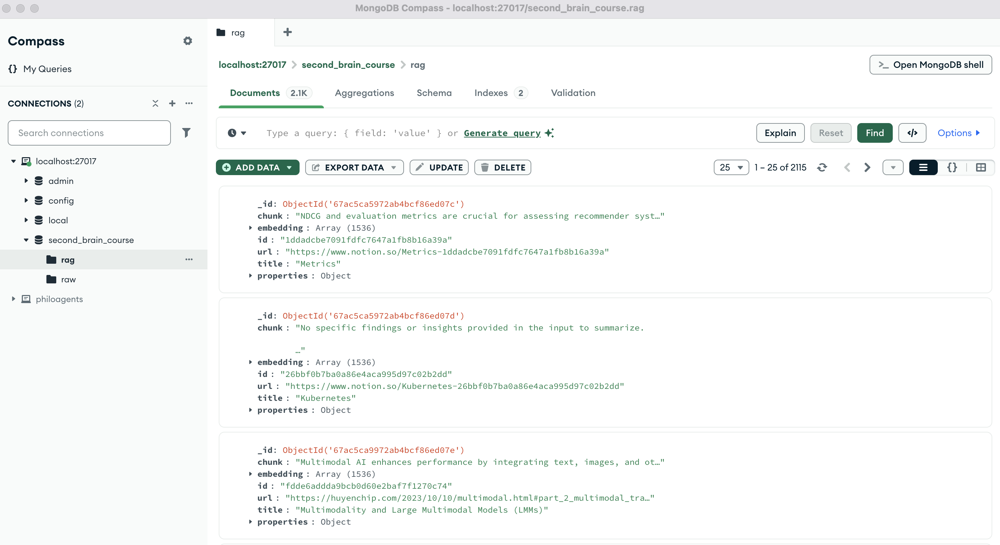
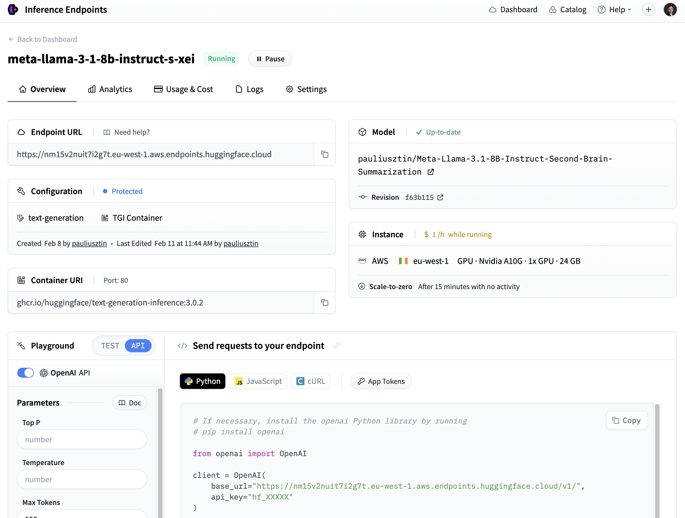

<table style="border-collapse: collapse; border: none;">
  <tr style="border: none;">
    <td width="20%" style="border: none;">
      <a href="https://decodingml.substack.com/" aria-label="Decoding ML">
        
      </a>
    </td>
    <td width="80%" style="border: none;">
      <div>
        <h2>📬 Stay Updated</h2>
        <p><b><a href="https://decodingml.substack.com/">Join Decoding ML</a></b> for proven content on production-grade AI, GenAI, and information retrieval systems. Every week, straight to your inbox.</p>
      </div>
    </td>
  </tr>
</table>

<p align="center">
  <a href="https://decodingml.substack.com/">
    
  </a>
</p>

------

# 🚀 Installation and Usage Guide for the Second Brain Offline Module

This guide will help you set up and run the Second Brain Offline Module which contains the code for **Modules 1-5**.

# 📑 Table of Contents

- [📋 Prerequisites](#-prerequisites)
- [🎯 Getting Started](#-getting-started)
- [📁 Project Structure](#-project-structure)
- [🏗️ Set Up Your Local Infrastructure](#-set-up-your-local-infrastructure)
- [⚡️ Running the Code for Each Module](#️-running-the-code-for-each-module)
- [🔧 Utlity Commands](#-utility-commands)
- [🧊 Setup Notion (optional)](#-setup-notion-optional)

# 📋 Prerequisites

## Local Tools

For all the modules, you'll need the following tools installed locally:

| Tool | Version | Purpose | Installation Link |
|------|---------|---------|------------------|
| Python | 3.12 | Programming language runtime | [Download](https://www.python.org/downloads/) |
| uv | ≥ 0.4.30 | Python package installer and virtual environment manager | [Download](https://github.com/astral-sh/uv) |
| GNU Make | ≥ 3.81 | Build automation tool | [Download](https://www.gnu.org/software/make/) |
| Git | ≥2.44.0 | Version control | [Download](https://git-scm.com/downloads) |
| Docker | ≥27.4.0 | Containerization platform | [Download](https://www.docker.com/get-started/) |

## Cloud Services

Also, the course requires access to these cloud services. The authentication to these services is done by adding the corresponding environment variables to the `.env` file:

| Service | Purpose | Cost | Environment Variable | Setup Guide | Starting with Module |
|---------|---------|------|---------------------|-------------| ---------------------|
| [OpenAI API](https://openai.com/index/openai-api/) | LLM API | Pay-per-use | `OPENAI_API_KEY` | [Quick Start Guide](https://platform.openai.com/docs/quickstart) | Module 2 |
| [Hugging Face](https://huggingface.com/) | MLOps | Free tier | `HUGGINGFACE_ACCESS_TOKEN` | [Quick Start Guide](https://huggingface.co/docs/hub/en/security-tokens) | Module 3 |
| [Comet](https://rebrand.ly/second-brain-course-comet)  | Experiment tracking |  Free tier | `COMET_API_KEY` | [Quick Start Guide](https://rebrand.ly/second-brain-course-comet-quickstart) | Module 4 |
| [Opik](https://rebrand.ly/second-brain-course-opik) | LLM evaluation and prompt monitoring | Free tier (Hosted on Comet - same API Key) | `COMET_API_KEY` | [Quick Start Guide](https://rebrand.ly/second-brain-course-comet-quickstart) | Module 6 |

When working locally, the infrastructure is set up using Docker. Thus, you can use the default values found in the [config.py](src/second_brain_offline/config.py) file for all the infrastructure-related environment variables.

But, in case you want to deploy the code, you'll need to setup the following services with their corresponding environment variables:

| Service | Purpose | Cost | Required Credentials | Setup Guide |
|---------|---------|------|---------------------|-------------| 
| [MongoDB](https://rebrand.ly/second-brain-course-mongodb) | document database (with vector search) | Free tier | `MONGODB_URI` | 1. [Create a free MongoDB Atlas account](https://rebrand.ly/second-brain-course-mongodb-setup-1) <br> 2. [Create a Cluster](https://rebrand.ly/second-brain-course-mongodb-setup-2) </br> 3. [Add a Database User](https://rebrand.ly/second-brain-course-mongodb-setup-3) </br> 4. [Configure a Network Connection](https://rebrand.ly/second-brain-course-mongodb-setup-4) |

# 🎯 Getting Started

## 1. Clone the Repository

Start by cloning the repository and navigating to the project directory:
```
git clone https://github.com/decodingml/second-brain-ai-assistant-course.git
cd second-brain-ai-assistant-course 
```

## 2. Installation

First deactivate any active virtual environment and move to the `second-brain-offline` directory:
```bash
deactivate
cd apps/second-brain-offline
```

To install the dependencies and activate the virtual environment, run the following commands:

```bash
uv venv .venv-offline
. ./.venv-offline/bin/activate # or source ./.venv-offline/bin/activate
uv pip install -e .
```

We use [Crew4AI](https://github.com/unclecode/crawl4ai) for crawling. To finish setting it up you have to run some post-installation setup commands (more on why this is needed in their [docs](https://github.com/unclecode/crawl4ai)):
```bash
# Run post-installation setup
uv pip install -U "crawl4ai==0.4.247" # We have to upgrade crawl4ai to support these CLI commands (we couldn't add it to pyproject.toml due to ZenML version incompatibility with Pydantic).
crawl4ai-setup

# Verify your installation
crawl4ai-doctor
```

> [!IMPORTANT]
> As crawling can often fail, both during installation and while running the crawling logic, you can skip the crawling step and use our pre-computed dataset. More on this in the [Running the ML pipelines / Lessons](#running-the-ml-pipelines--lessons) section.

After running the doctor command, you should see something like this:
```console
[INIT].... → Running Crawl4AI health check...
[INIT].... → Crawl4AI 0.4.247
[TEST].... ℹ Testing crawling capabilities...
[EXPORT].. ℹ Exporting PDF and taking screenshot took 0.84s
[FETCH]... ↓ https://crawl4ai.com... | Status: True | Time: 3.91s
[SCRAPE].. ◆ Processed https://crawl4ai.com... | Time: 11ms
[COMPLETE] ● https://crawl4ai.com... | Status: True | Total: 3.92s
[COMPLETE] ● ✅ Crawling test passed!
```
[More on installing Crawl4AI](https://docs.crawl4ai.com/core/installation/)

## 3. Environment Configuration

Before running any command, you have to set up your environment:
1. Create your environment file:
   ```bash
   cp .env.example .env
   ```
2. Open `.env` and configure the required credentials following the inline comments and the recommendations from the [Cloud Services](#-prerequisites) section.

# 📁 Project Structure

At Decoding ML we teach how to build production ML systems. Thus, instead of splitting the code into separate modules, the course follows the structure of a real-world Python project:

```bash
.
├── configs/                   # ZenML configuration files
├── pipelines/                 # ZenML ML pipeline definitions
├── src/second_brain_offline/  # Main package directory
│   ├── application/           # Application layer
│   ├── domain/                # Domain layer
│   ├── infrastructure/        # Infrastructure layer
│   ├── config.py              # Configuration settings
│   └── utils.py               # Utility functions
├── steps/                     # ZenML pipeline steps
├── tests/                     # Test files
├── tools/                     # Entrypoint scripts that use the Python package
├── .env.example               # Environment variables template
├── .python-version            # Python version specification
├── Makefile                   # Project commands
└── pyproject.toml             # Project dependencies
```

# 🏗️ Set Up Your Local Infrastructure

We use Docker to set up the local infrastructure (ZenML, MongoDB).

> [!WARNING]
> Before running the command below, ensure you do not have any processes running on port `27017` (MongoDB) and `8237` (ZenML).

To start the Docker infrastructure, run:
```bash
make local-infrastructure-up
```

To stop the Docker infrastructure, run:
```bash
make local-infrastructure-down
```

> [!NOTE]
> To visualize the raw and RAG data from MongoDB, we recommend using [MongoDB Compass](https://rebrand.ly/second-brain-course-mongodb-compass) or Mongo's official IDE plugin (e.g., `MongoDB for VS Code`). To connect to the working MongoDB instance, use the `MONGODB_URI` value from the `.env` file or found inside the [config.py](src/second_brain_offline/config.py) file.



# ⚡️ Running the Code for Each Module

To simulate the course modules, we split the CLI commands and offline ML pipelines you must run per module so you know exactly where you are in the course.

## Module 1: Build your Second Brain AI assistant

No code to run for this module, as it lays down the overall architecture of the Second Brain AI assistant. 

We recommend to read the [first lesson](https://decodingml.substack.com/p/build-your-second-brain-ai-assistant) to better understand the AI system architecture of the Second Brain AI assistant, where we teach best practices for building production ML systems using MLOps best practices.

## Module 2: ETL pipeline

### Prepare Notion data

Download our prepared Notion dataset from S3 (recommended):
```bash
make download-notion-dataset
# Validate using test: make test-download-notion-dataset
```

**OR** if you want to collect your own Notion data (optional - if you want to use your own data):
```bash
make collect-notion-data-pipeline
```

> [!IMPORTANT]
> If running `make download-notion-dataset` fails, type `https://decodingml-public-data.s3.eu-central-1.amazonaws.com/second_brain_course/notion/notion.zip` in your browser to download the dataset manually. Unzip `notion.zip` and place it under the `data` directory as follows: `data/notion` (create the `data` directory if it doesn't exist).

### Run the ETL pipeline

Run the ETL pipeline to crawl, score and ingest the Notion data into MongoDB:
```bash
make etl-pipeline
```
Running criteria:
- Running costs: ~$0.5
- Running time: ~30 minutes

**OR** if you want to avoid any costs or waiting times, you can use our pre-computed dataset to populate MongoDB. Also, as crawling can often fail and it is more compute-heavy, you can use this command to skip the crawling step (the outcome will be the same as using `make etl-pipeline`):
```bash
make download-crawled-dataset
# Validate using test: make test-download-crawled-dataset
make etl-precomputed-pipeline
```

> [!IMPORTANT]
> If running `make download-crawled-dataset` fails, type `https://decodingml-public-data.s3.eu-central-1.amazonaws.com/second_brain_course/crawled/crawled.zip` in your browser to download the dataset manually. Unzip `crawled.zip` and place it under the `data` directory as follows: `data/crawled` (create the `data` directory if it doesn't exist).

## Module 3: Generate Fine-tuning Dataset

```bash
make generate-dataset-pipeline
```
Running criteria:
- Running costs: ~$1.5
- Running time: ~60 minutes

**OR** in case you want to avoid any costs or waiting times, you can use our pre-computed dataset available on Hugging Face, which is already set as the default value in the required ZenML configs: [pauliusztin/second_brain_course_summarization_task](https://huggingface.co/datasets/pauliusztin/second_brain_course_summarization_task).

## Module 4: Fine-tuning and Deploying Summarization LLM

### Fine-tuning and Evaluating the Summarization LLM

As Notebooks are popular when it comes to LLM fine-tuning, we provide a notebook for each step of the fine-tuning process. 

For the full fine-tuning we used Google Colab Pro, with an L4 GPU. But the notebooks will also run with the free tier of Google Colab on an T4 GPU. But to work on a T4 GPU we have to leverage QLoRA instead of LoRA, which makes the fine-tuning process slower. To conclude, you can run them with 0 costs on Google Colab.

| Purpose | Notebook | Useful Resources |
|---------|----------|------------------|
| Training | [](https://colab.research.google.com/github/decodingml/second-brain-ai-assistant-course/blob/main/apps/second-brain-offline/src/second_brain_offline/application/models/finetuning.ipynb) | [Example of an experiment using the Comet experiment tracker](https://rebrand.ly/second-brain-course-comet-example) |
| Inference | [](https://colab.research.google.com/github/decodingml/second-brain-ai-assistant-course/blob/main/apps/second-brain-offline/src/second_brain_offline/application/models/inference.ipynb) | [Our fine-tuned LLM available on Hugging Face](https://huggingface.co/pauliusztin/Meta-Llama-3.1-8B-Instruct-Second-Brain-Summarization) |
| Evaluation | [](https://colab.research.google.com/github/decodingml/second-brain-ai-assistant-course/blob/main/apps/second-brain-offline/src/second_brain_offline/application/models/evaluate.ipynb) | [Our fine-tuned LLM available on Hugging Face](https://huggingface.co/pauliusztin/Meta-Llama-3.1-8B-Instruct-Second-Brain-Summarization) |

Running criteria:
- Running costs: $0 (running on Google Colab free tier)
- Training running time: ~4 and 12 hours (depending on the GPU and number of iterations)
- Evaluation running time: <30 minutes

**OR** in case you want to avoid any costs or waiting times, you can deploy our fine-tuned LLM available on Hugging Face: [pauliusztin/Meta-Llama-3.1-8B-Instruct-Second-Brain-Summarization](https://huggingface.co/pauliusztin/Meta-Llama-3.1-8B-Instruct-Second-Brain-Summarization).

### Deploying the Summarization LLM (Optional)

**This step is optional**, in case you want to learn to deploy your fine-tuned LLM and use it in the agentic app. We are offering the possability to use OpenAI instead of our custom fine-tuned LLM, to avoid forcing you to deploy the model resulting in additional costs.

We will use [Hugging Face Inference Endpoints](https://endpoints.huggingface.co/) to deploy the fine-tuned LLM.

To deploy the model, you have to follow these steps:
1. Login to [Hugging Face Inference Endpoints](https://endpoints.huggingface.co/)
2. Add your billing information
3. Use our step-by-step guide to deploy the model: [Creating Inference Endpoint Guide](../../static/creating_inference_endpoint.pdf)

> [!IMPORTANT]
> We will use an A10G GPU to deploy the model, which costs ~$1.00 per hour.

To hook the Hugging Face Inference Endpoint to the code and the RAG ingestion pipeline, you need to set the `HUGGINGFACE_DEDICATED_ENDPOINT` and `HUGGINGFACE_ACCESS_TOKEN` environment variables in the `.env` file, as follows (you can use the same HF token you used so far):
```
HUGGINGFACE_DEDICATED_ENDPOINT=https://um18v2aeit3f6g1b.eu-west-1.aws.endpoints.huggingface.cloud/v1/
HUGGINGFACE_ACCESS_TOKEN=hf_...
```

> [!IMPORTANT]
> When configuring the `HUGGINGFACE_DEDICATED_ENDPOINT`, you need to make sure that the endpoint URL ends with `/v1/`, as seen in the image above. You can copy the valid URL from the **API** tab in the **Playground** section of the dashboard, as seen in the image below.



After setting the environment variables, you can check that it works by running the following command:
```bash
make check-huggingface-dedicated-endpoint
```

You should see something about the **Eiffel Tower** in the output:
```console
The main facts of the Eiffel Tower from the text are as follows :
- **Height :** The Eiffel Tower stands at a height of 324 metres (1,063 ft).
- **Bases measurement:** The base of the tower is a square with each side measuring 125 metres (410 ft).
....
```

## Module 5: RAG Feature Pipeline - Populate the RAG Vector Database

We support multiple RAG ingestion methods using either OpenAI or your deployed Hugging Face models, with parent or contextual retrieval algorithms.

**Recommended progression:**

1. Start with parent retrieval (fastest, simplest)
2. Move to simple contextual retrieval with OpenAI
3. Try simple contextual with Hugging Face Inference Endpoints (if you've deployed your model)
4. Finally, run the full-fledged contextual retrieval algorithm with OpenAI models

> [!IMPORTANT]
> Before switching algorithms, run `make delete-rag-collection` to clear existing embeddings.

To make the ingestion faster or cheaper, you can adjust the ingestion parameters in `configs/*.yaml`:
- `fetch_limit`: Number of documents to process
- `content_quality_score_threshold`: Filtering aggressiveness

### 5.1. Parent Retrieval Algorithm with OpenAI models

```bash
make delete-rag-collection
make compute-rag-vector-index-openai-parent-pipeline
```
Running criteria:
- Cost (OpenAI API): ~$0.05
- Time: ~2 minutes
- Indexes all docs

Check that the RAG ingestion worked:

```bash
make check-rag-openai-parent
```

### 5.2. Simple Contextual Retrieval Algorithm with OpenAI models

Run the ingestion pipeline:
```bash
make delete-rag-collection
make compute-rag-vector-index-openai-contextual-simple-pipeline
```
Running criteria:
- Cost (OpenAI API): ~$0.15
- Time: ~20 minutes
- Indexes ~120 docs

Check that the RAG ingestion worked:
```bash
make check-rag-openai-contextual-simple
```

### 5.3. Simple Contextual Retrieval Algorithm with Hugging Face Inference Endpoints (Optional)

Before running this step, make sure you have deployed your Hugging Face model to Hugging Face Inference Endpoints and that it is not idle (it goes idle out-of-box after 15 minutes of inactivity).

Run the ingestion pipeline:
```bash
make delete-rag-collection
make compute-rag-vector-index-huggingface-contextual-simple-pipeline
```
Running criteria:
- Cost (Hugging Face Inference Endpoints): ~$0.6
- Time: ~40 minutes
- Indexes ~60 docs

Check that the RAG ingestion worked:
```bash
make check-rag-huggingface-contextual-simple
```

### 5.4. Full-fledged Contextual Retrieval Algorithm with OpenAI models

Run the ingestion pipeline:
```bash
make delete-rag-collection
make compute-rag-vector-index-openai-contextual-pipeline
```
Running criteria:
- Cost (OpenAI API): ~$0.1
- Time: ~11 minutes
- Indexes ~20 docs

Check that the RAG ingestion worked:
```bash
make check-rag-openai-contextual
```

## Lesson 6: Agentic App

The Agentic App sits in the online environment, which is implemented as a different Python application.

Go to the [apps/second-brain-online](../second-brain-online/) folder and follow the instructions there to set it up and run it.

<video src="https://github.com/user-attachments/assets/bfea8e24-6d52-4a33-8857-5d05154ab69e"/></video>

# 🔧 Utlity Commands

## Formatting

```
make format-check
make format-fix
```

## Linting

```bash
make lint-check
make lint-fix
```

## Tests

```bash
make test
```

# 🧊 Setup Notion (optional)

In case you want to use your own Notion data, you can follow these steps to set up an integration and read from your Notion database:

1. Go to [https://www.notion.so/profile](https://www.notion.so/profile).
2. Create an integration following [this tutorial](https://developers.notion.com/docs/authorization).
3. Copy your integration secret, and set the `NOTION_SECRET_KEY` environment variable in the `.env` file.
4. Share your database with the integration:
   - Open your Notion database
   - Click the '...' menu in the top right
   - Click 'Add connections'
   - Select your integration
5. Get the correct database ID:
   - Open your database in Notion
   - Copy the ID from the URL: 
     ```
     https://www.notion.so/{workspace}/{database_id}?v={view_id}
     ```
     (The database ID is the part between the workspace name and the question mark)
   - Update the `database_ids` parameter in the `configs/collect_notion_data.yaml` file with your database ID(s). Just make sure to remove ours and add only yours.
