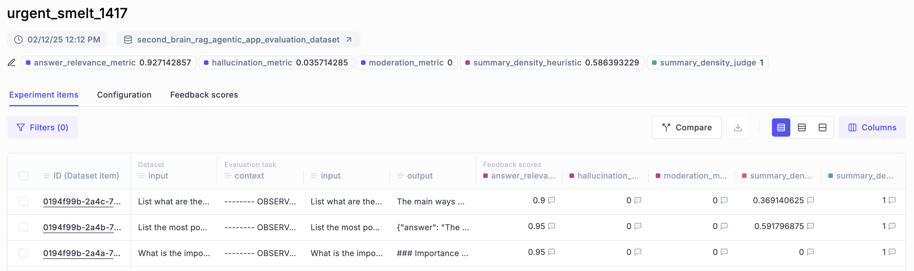

# 🚀 Installation and Usage Guide for the Second Brain Online Module

This guide will help you set up and run the Second Brain Online Module which contains the code for **Module 6: the RAG agentic app and LLMOps layer**.

Note that this module is completely independent from the offline ML pipelines. Thus, it comes with its own set of dependencies and requirements. Also, it is required to have the offline ML pipelines running in order to use this module.

# 📑 Table of Contents

- [📋 Prerequisites](#-prerequisites)
- [🎯 Getting Started](#-getting-started)
- [📁 Project Structure](#-project-structure)
- [🏗️ Set Up Your Local Infrastructure](#-set-up-your-local-infrastructure)
- [⚡️ Running the Code for Each Module](#️-running-the-code-for-each-module)
- [🔧 Utlity Commands](#-utility-commands)

# 📋 Prerequisites

We depend on the same prerequisites as the offline ML pipelines. If modules 1 to 5 are working, you are good to go. Just make sure to fill in the `.env` file with the correct credentials.

## Local Tools

For all the modules, you'll need the following tools installed locally:

| Tool | Version | Purpose | Installation Link |
|------|---------|---------|------------------|
| Python | 3.11 | Programming language runtime | [Download](https://www.python.org/downloads/) |
| uv | ≥ 0.4.30 | Python package installer and virtual environment manager | [Download](https://github.com/astral-sh/uv) |
| GNU Make | ≥ 3.81 | Build automation tool | [Download](https://www.gnu.org/software/make/) |
| Git | ≥2.44.0 | Version control | [Download](https://git-scm.com/downloads) |
| Docker | ≥27.4.0 | Containerization platform | [Download](https://www.docker.com/get-started/) |

## Cloud Services

Also, the course requires access to these cloud services. The authentication to these services is done by adding the corresponding environment variables to the `.env` file:

| Service | Purpose | Cost | Required Credentials | Setup Guide | Starting with Module |
|---------|---------|------|---------------------|-------------| ---------------------|
| [OpenAI API](https://openai.com/index/openai-api/) | LLM API | Pay-per-use | `OPENAI_API_KEY` | [Quick Start Guide](https://platform.openai.com/docs/quickstart) | Module 2 |
| [Hugging Face](https://huggingface.com/) | MLOps | Free tier | `HUGGINGFACE_ACCESS_TOKEN` | [Quick Start Guide](https://huggingface.co/docs/hub/en/security-tokens) | Module 3 |
| [Comet ML](https://rebrand.ly/second-brain-course-comet)  | Experiment tracking |  Free tier | `COMET_API_KEY` | [Quick Start Guide](https://rebrand.ly/second-brain-course-comet-quickstart) | Module 4 |
| [Opik](https://rebrand.ly/second-brain-course-opik) | LLM evaluation and prompt monitoring | Free tier  | `COMET_API_KEY` | [Quick Start Guide](https://rebrand.ly/second-brain-course-comet-quickstart) | Module 6 |

When working locally, the infrastructure is set up using Docker. Thus, you can use the default values found in the `config.py` for all the infrastructure-related environment variables.

But, in case you want to deploy the code, you'll need to setup the following services with their corresponding environment variables:

| Service | Purpose | Cost | Required Credentials | Setup Guide |
|---------|---------|------|---------------------|-------------| 
| [MongoDB](https://rebrand.ly/second-brain-course-mongodb) | NoSQL and vector database | Free tier | `MONGODB_URI` | 1. [Create a free MongoDB Atlas account](https://rebrand.ly/second-brain-course-mongodb-setup-1) <br> 2. [Create a Cluster](https://rebrand.ly/second-brain-course-mongodb-setup-2) </br> 3. [Add a Database User](https://rebrand.ly/second-brain-course-mongodb-setup-3) </br> 4. [Configure a Network Connection](https://rebrand.ly/second-brain-course-mongodb-setup-4) |

# 🎯 Getting Started

## 1. Clone the Repository

Start by cloning the repository and navigating to the project directory:
```bash
git clone https://github.com/decodingml/second-brain-ai-assistant-course.git
cd second-brain-ai-assistant-course 
```

## 2. Installation

First deactivate any active virtual environment and move to the `second-brain-online` directory:
```bash
deactivate
cd apps/second-brain-online
```

To install the dependencies and activate the virtual environment, run the following commands:

```bash
uv venv .venv-online
. ./.venv-online/bin/activate
uv pip install -e .
```

> [!NOTE]
> The online application uses a different set of dependencies than the offline ML pipelines.

## 3. Environment Configuration

Before running any command, you have to set up your environment:
1. Create your environment file:
   ```bash
   cp .env.example .env
   ```
2. Open `.env` and configure the required credentials following the inline comments and the recommendations from the [Cloud Services](#-prerequisites) section.

# 📁 Project Structure

At Decoding ML we teach how to build production ML systems. Thus, instead of splitting the code into separate modules, the course follows the structure of a real-world Python project:

```bash
.
├── configs/                   # ZenML configuration files
├── src/second_brain_online/  # Main package directory
│   ├── application/           # Application layer
│   ├── config.py              # Configuration settings
│   └── opik_utils.py          # Opik utility functions
├── tools/                     # Entrypoint scripts that use the Python package
├── .env.example               # Environment variables template
├── .python-version            # Python version specification
├── Makefile                   # Project commands
└── pyproject.toml             # Project dependencies
```

# 🏗️ Set Up Your Local Infrastructure

We use Docker to setup the local infrastructure (MongoDB).

To start it, run:
```bash
make local-infrastructure-up
```

To stop it, run:
```bash
make local-infrastructure-down
```

# ⚡️ Running the Code for Each Module

To simulate the course modules, we split the CLI commands and offline ML pipelines you must run per module so you know exactly where you are in the course.

## Module 6: Running the RAG Agentic App and LLMOps Layer

Quickly test the agent from the CLI with a predefined query:
```bash
make run_agent_query RETRIEVER_CONFIG=configs/compute_rag_vector_index_openai_parent.yaml
```
You should see something like this:
```console
Vector databases and vector indices are related concepts in the field of data storage and retrieval, particularly in contexts where high-dimensional vector representations of data are used, such as in machine learning and AI. Here are the key differences:

1. **Vector Databases**:
   - A vector database ...
```

> [!IMPORTANT]
> Be sure that the retriever config is the exact same one as the one used in Module 5 during the RAG feature pipeline to populate the vector database. If they don't match, the used retriever will use different settings resulting in errors or unexpected results. Here is a quick reminder of when to use which config:
> 1. Parent Retrieval with OpenAI models:  `configs/compute_rag_vector_index_openai_parent.yaml`
> 2. Simple Contextual Retrieval with OpenAI models: `configs/compute_rag_vector_index_openai_contextual_simple.yaml`
> 3. Simple Contextual Retrieval with Hugging Face models: `configs/compute_rag_vector_index_huggingface_contextual_simple.yaml`
> 4. Full-fledged Contextual Retrieval with OpenAI models: `configs/compute_rag_vector_index_openai_contextual.yaml`

You can also spin-up a Gradio UI to test the agent with custom queries similar to any other chatbot:
```bash
make run_agent_app RETRIEVER_CONFIG=configs/compute_rag_vector_index_openai_parent.yaml
```
You should see something like this:


Evaluate the agent with our predefined evaluation queries (found under `tools/evaluate_app.py`):
```bash
make evaluate_agent RETRIEVER_CONFIG=configs/compute_rag_vector_index_openai_parent.yaml
```

After running the evaluation, open [Opik](https://rebrand.ly/second-brain-course-opik-dashboard) to see the evaluation results, as seen in the image below:



For running the evaluation, plus playing around with the agent (~20 queries), the costs and running time are:
- Running costs OpenAI: ~$0.5
- Running costs Hugging Face Dedicated Endpoints (optional - you can use only the OpenAI models for summarization): ~$1 (the deployment costs $1 / hour)
- Running time evaluation: ~15 minutes (the AI Assistant runs in real-time)


# 🔧 Utlity Commands

## Formatting

```
make format-check
make format-fix
```

## Linting

```bash
make lint-check
make lint-fix
```